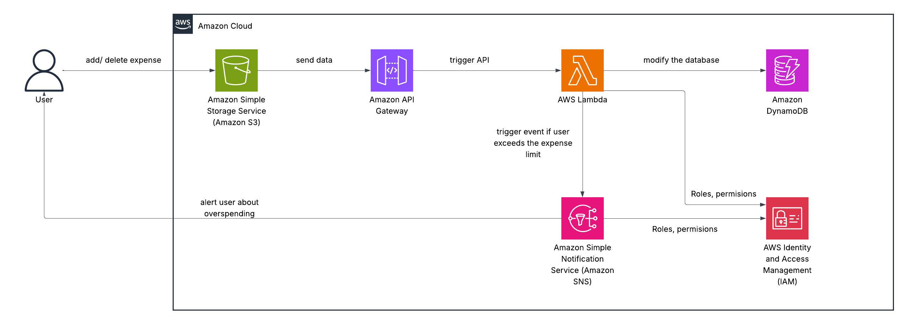

# Expense Management System (AWS Serverless Architecture)

A fully serverless, scalable expense tracking application built on AWS.  
Users can add or delete expenses, view their spending, and receive alerts when they exceed their budget.  
The system runs entirely on managed AWS services, requiring no servers or manual scaling.

---

## 🚀 Features

- Add & delete expenses through an S3-hosted web interface  
- API Gateway as backend entry point  
- AWS Lambda for compute logic  
- DynamoDB for storing expense data  
- SNS notifications when spending exceeds limit  
- IAM roles for secure, credential-free access  
- Fully serverless, low-cost, auto-scaling

---

## 🏗 Architecture Overview

The application follows an event-driven serverless architecture:

1. **Amazon S3** hosts the static frontend (HTML/CSS/JS).
2. **API Gateway** exposes secure REST endpoints.
3. **AWS Lambda** receives requests, validates data, and processes business logic.
4. **Amazon DynamoDB** stores all expense records.
5. **SNS** sends notifications when user spending exceeds a defined limit.
6. **IAM Roles** ensure least-privilege access between services.

This helped me understand how to build systems that are scalable, secure, and cost-efficient.
---

## 📚 Technologies Used

| Service | Purpose |
|--------|---------|
| Amazon S3 | Hosts static website |
| API Gateway | Receives frontend API calls |
| AWS Lambda | Executes backend logic |
| DynamoDB | Stores expense data |
| SNS | Sends overspending alerts |
| IAM | Security + permissions control |

I practiced:

- Assigning least-privilege policies  
- Troubleshooting permission issues (403 AccessDenied)
- Understanding how IAM + S3 + DynamoDB policies work together

This improved my AWS security fundamentals.
---

## 🧩 DynamoDB Table Structure

**Table Name:** `MyExpenses`

| Attribute | Type | Description |
|----------|------|-------------|
| `expense_id` | String (SK) | Unique ID per expense |
| `amount` | Number | Expense amount |
| `category` | String | Food, Transport, etc |
| `date` | String | Timestamp |

I implemented a backend API that interacts with DynamoDB.

Key learnings:

- Designing NoSQL tables  
- CRUD operations with partition/sort keys  
- Understanding throughput, consistency, and indexes

This strengthened my backend + database skills in a cloud environment.
---

## 🧠 Lambda Workflow

1. Receive request from API Gateway  
2. Parse JSON payload  
3. Validate fields  
4. Write/read from DynamoDB  
5. Recalculate total expenses  
6. If limit exceeded → publish message to SNS  

I learned about:

- S3 static web hosting  
- CORS configuration  
- Networking between the public frontend and the Lambda API

This helped me understand cloud-based web architecture end-to-end.
---

## 📬 Overspending Notifications

SNS can send:
- Email  

Triggered automatically by Lambda.

---

## 🔐 Security

- No hardcoded keys  
- All access granted through IAM execution roles  
- API Gateway protected via IAM/optional auth  

---

## 📦 Deployment

This project can be deployed using:
- AWS Console  
- AWS CLI  
- IaC (CloudFormation / Terraform / CDK) — optional  

---

## 🧪 Possible Extensions

- Add Cognito user authentication  
- Add monthly reports via SES  
- Add CloudWatch dashboards for analytics  
- Use Step Functions for multi-step flows  

---

## Step-by-step deployment guide:
1. Create a DynamoDB and name it, then name the partition key as expense_id.
2. Create 3 lambda functions(make sure the code has the table name the same as the name of the table you have created), then assign roles to them so they can have full control on DynamoDB (except get func, which only gets read only).
3. Create an API REST, add a resource for Get, Delete, and Post methods, then integrate it with Lambda.
4. Deploy that API, set the new stage, then name it prod, then copy the invoke URL
5. Create an S3 bucket, set public access, set permission getObject for *, upload the index.html file(replace the value of API_BASED to invoke URL you just copied earlier)
6. At this moment, the services should work as intended.
7. Create the SNS topic, subscribe your email to it, then copy the ARN
8. In IAM roles, on addExpenses role, add an additional policy so SNS can do the action: Publish
9. In addExpense function, replace the ARN placeholder
10. You are ready to gooooo!!!!
---

# ✅ Summary

This project strengthened my skills in:

- Cloud Architecture (Lambda, S3, DynamoDB, IAM)  
- Backend Development  
- IAM Security Practices  
- Troubleshooting and Debugging  
- NoSQL Database Modeling  
- Connecting Distributed Cloud Services  

It gave me a complete end-to-end experience building a cloud-hosted application from scratch

## ✨ Author
Hoàng Thái Dương  
Cloud & DevOps Engineer (in training)
